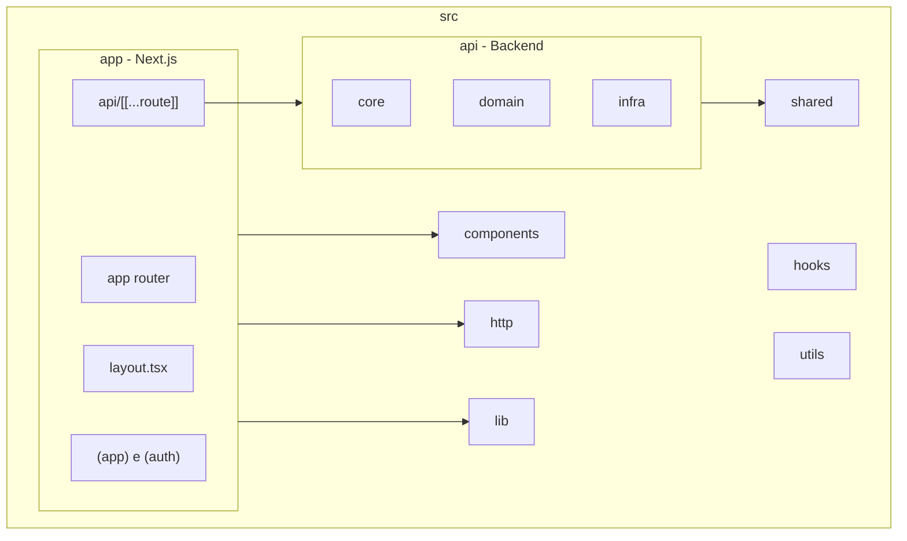
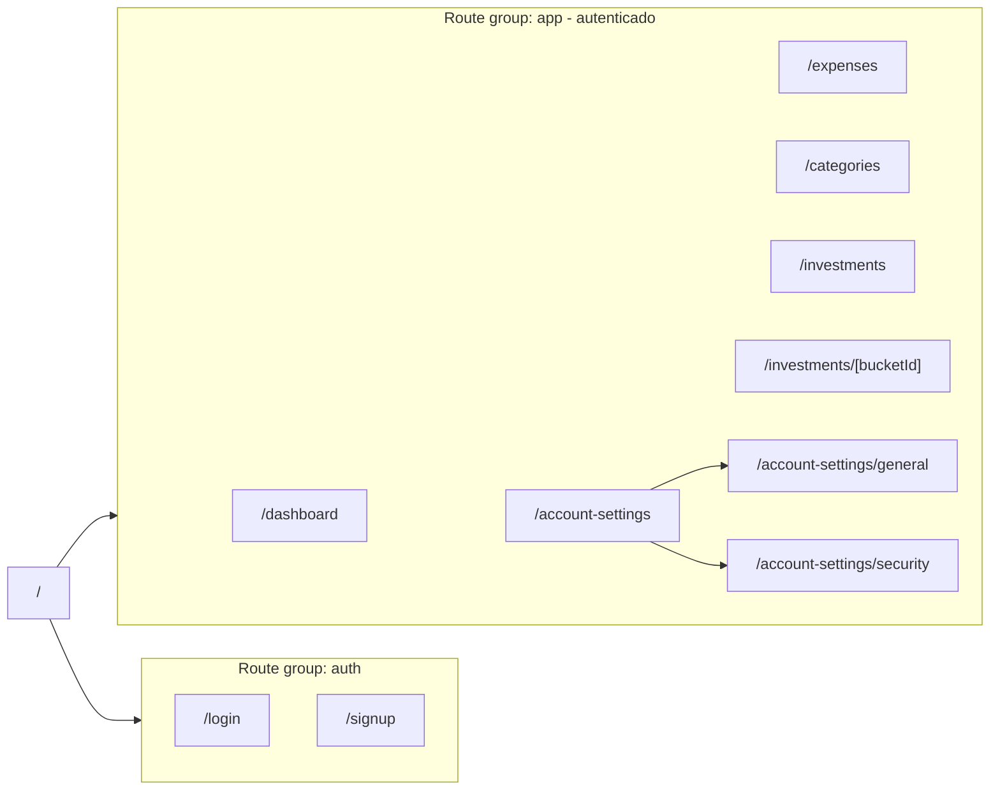
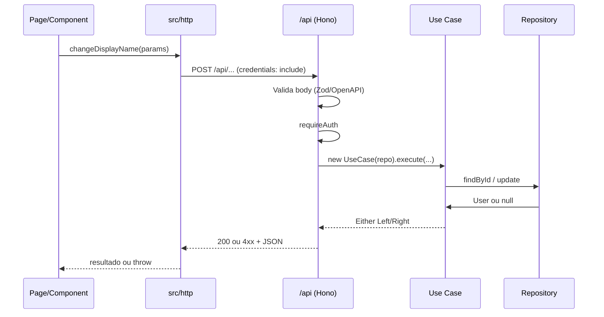
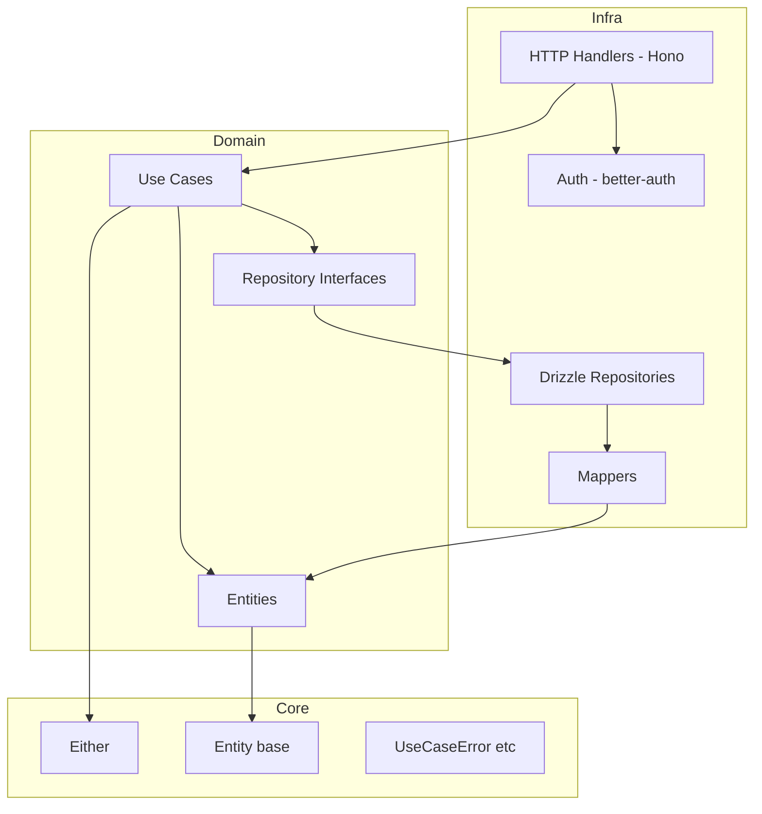
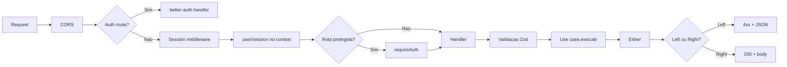

# Financial

Aplicação full-stack de gestão financeira: Next.js no frontend e API REST com Hono no mesmo repositório. Inclui controle de despesas, categorias e investimentos, com autenticação (email/senha e GitHub) e arquitetura de backend em camadas (Clean/DDD).

---

## Estrutura do projeto

O código-fonte fica em `src/`. A aplicação divide-se em: **app** (Next.js e UI), **api** (regras de negócio e HTTP), e pastas compartilhadas (**http** client, **lib**, **shared**, **hooks**, **utils**, **components**).



### Árvore de pastas (resumida)

```
src/
├── api/                    # Backend: domain, core, infra
│   ├── core/               # Either, Entity, erros, tipos base
│   ├── domain/             # Entidades, use cases, interfaces de repositório
│   ├── infra/              # HTTP (Hono), DB (Drizzle), auth, middlewares
│   └── index.ts            # App Hono + rotas + middlewares
├── app/                    # Next.js App Router
│   ├── (app)/              # Rotas autenticadas: dashboard, expenses, etc.
│   ├── (auth)/             # login, signup
│   ├── api/[[...route]]/   # Proxy para a API Hono
│   ├── layout.tsx
│   └── globals.css
├── components/             # Componentes reutilizáveis e UI (shadcn)
│   ├── ui/                 # Primitivos (Button, Card, Dialog, etc.)
│   ├── app-shell.tsx
│   ├── app-sidebar.tsx
│   ├── page.tsx            # Page / PageHeader (composition)
│   └── user-menu.tsx
├── http/                   # Cliente HTTP: funções que chamam a API (fetch)
├── lib/                    # auth-client, auth-server, react-query, utils
├── shared/                 # Schemas Zod compartilhados (front + API)
├── hooks/
├── utils/
├── api-env.ts              # Variáveis de ambiente da API
└── env.ts                  # Variáveis de ambiente do frontend
```

- **`api/`**: contém toda a lógica de backend (domain, core, infra). O ponto de entrada é `api/index.ts`, que é montado em `app/api/[[...route]]/route.ts`, então todas as requisições a `/api/*` são tratadas pelo Hono.
- **`app/`**: rotas, layouts e páginas do Next.js. Route groups `(app)` e `(auth)` não alteram a URL; apenas organizam layout e proteção (ex.: layout de `(app)` exige sessão).
- **`components/`**: componentes globais (shell, sidebar, page) e `ui/` com os primitivos do shadcn.
- **`http/`**: uma função por “ação” da API (ex.: `changeDisplayName`), usando `fetch` e `credentials: 'include'`.
- **`shared/schemas/`**: schemas Zod usados tanto na validação da API quanto no frontend (tipos e contratos únicos).

---

## Geral

- **Projeto**: monólito full-stack (front + API) para controle financeiro (despesas, categorias, investimentos).
- **Runtime e pacotes**: [Bun](https://bun.sh) (lockfile `bun.lock`), módulos ESM (`"type": "module"`).
- **Linguagem**: TypeScript em modo strict, target ES2022; path alias `@/*` → `./src/*` ([tsconfig.json](tsconfig.json)).
- **Qualidade de código**:
  - **ESLint**: `eslint-config-next` (core-web-vitals + TypeScript), Prettier e `eslint-plugin-simple-import-sort` (ordem de imports como erro) — [eslint.config.mjs](eslint.config.mjs).
  - **Prettier**: printWidth 80, tabWidth 2, singleQuote, trailingComma all, arrowParens always, semi false.
- **Testes**: [Vitest](https://vitest.dev) (`npm run test` / `npm run test:watch`); testes em `*.test.ts` (ex.: [src/lib/calculations.test.ts](src/lib/calculations.test.ts)).
- **Banco e ambiente**: PostgreSQL 17 via [docker-compose.yml](docker-compose.yml); variáveis em [src/api-env.ts](src/api-env.ts) (API) e [src/env.ts](src/env.ts) (frontend).
- **Scripts**: `dev`, `build`, `start`, `lint`, `test`, `db:generate`, `db:migrate`, `db:push`, `db:studio`, `db:seed`.

### Como rodar

1. Instalar dependências: `bun install` ou `npm install`.
2. Configurar `.env` com `DATABASE_URL`, `BETTER_AUTH_*`, `NEXT_PUBLIC_API_URL` etc. (ver `src/api-env.ts` e `src/env.ts`).
3. Subir o Postgres: `docker compose up -d`.
4. Aplicar schema: `bun run db:push` ou `bun run db:migrate`.
5. Iniciar o app: `bun run dev` ou `npm run dev`.

---

## Frontend

- **Framework**: [Next.js](https://nextjs.org) 16 com App Router e [React](https://react.dev) 19; [React Compiler](https://react.dev/learn/react-compiler) ativado em [next.config.ts](next.config.ts).
- **Rotas**: Route groups `(app)` (área autenticada) e `(auth)` (login/signup). O layout [src/app/(app)/layout.tsx](src/app/(app)/layout.tsx) valida sessão no servidor e redireciona para `/login` se não autenticado.
- **UI e estilo**:
  - [shadcn/ui](https://ui.shadcn.com) (estilo **new-york**, base **zinc**, CSS variables, RSC + TSX) — [components.json](components.json); ícones [Lucide](https://lucide.dev).
  - Componentes em `src/components/ui/` (Radix + Tailwind); layout em `src/components/` (ex.: [app-shell](src/components/app-shell.tsx), [app-sidebar](src/components/app-sidebar.tsx), [user-menu](src/components/user-menu.tsx)).
  - [Tailwind CSS](https://tailwindcss.com) v4 em [src/app/globals.css](src/app/globals.css): `@import "tailwindcss"`, `tw-animate-css`, `tailwind-scrollbar`, tema com variáveis (radius, cores semânticas).
- **Formulários**: [React Hook Form](https://react-hook-form.com) + `@hookform/resolvers` (Zod) + componentes Form do shadcn; validação com Zod no cliente (ex.: [display-name-edit.tsx](src/app/(app)/account-settings/general/_components/display-name-edit.tsx)).
- **Dados e chamadas**: [TanStack React Query](https://tanstack.com/query/latest) em [src/lib/react-query-provider.tsx](src/lib/react-query-provider.tsx); funções em `src/http/*` usam `fetch` com `credentials: 'include'` para a API em `NEXT_PUBLIC_API_URL`.
- **Autenticação**: [better-auth](https://www.better-auth.com) no cliente (`authClient.useSession()` etc.) em [src/lib/auth-client.ts](src/lib/auth-client.ts).
- **Padrões**:
  - **Composition (Compound Components)**: componentes compostos são exportados como um único objeto com subcomponentes nomeados (ex.: `SettingsCard.Root`, `SettingsCard.Content`, `Page.Root`, `PageHeader.Title`). Cada subcomponente estende `ComponentProps` do elemento base e o uso no JSX fica declarativo, ex.: `<SettingsCard.Root><SettingsCard.Content>...</SettingsCard.Content></SettingsCard.Root>`. Exemplos: [settings-card.tsx](src/app/(app)/account-settings/_components/settings-card.tsx) (Root, Content, Header, Title, Description, Footer, Action, Form, etc.) e [page.tsx](src/components/page.tsx) (Page.Root/Content, PageHeader.Root/Title/Description).
  - Componentes de página/feature ficam em `_components` dentro da rota (ex.: `account-settings/general/_components/`).
  - Client components com `'use client'` quando usam hooks ou interatividade; Server Components por padrão.
  - Feedback: [Sonner](https://sonner.emilkowal.ski) para toasts; Spinner em botões de submit.
- **Outros**: [Recharts](https://recharts.org) para gráficos; [Motion](https://motion.dev) para animações; [date-fns](https://date-fns.org); [react-day-picker](https://daypicker.dev) em calendários.

### Estrutura de rotas (App Router)



As pastas `(app)` e `(auth)` são route groups (não aparecem na URL). O layout de `(app)` chama `getSessionForServer()` e redireciona para `/login` se não houver sessão.

### Fluxo de uma ação no frontend



A página usa React Hook Form; no submit chama uma função de `src/http/*`, que faz `fetch` para `/api/*`. A API valida, aplica auth, executa o use case (que usa repositório Drizzle) e devolve status + JSON.

---

## Backend

- **API**: [Hono](https://hono.dev) com [OpenAPIHono](https://hono.dev/docs/openapi) em [src/api/index.ts](src/api/index.ts), exposta via Next.js em [src/app/api/[[...route]]/route.ts](src/app/api/[[...route]]/route.ts) (GET, POST, PUT, DELETE, PATCH, etc.). Base path: `/api`.
- **Autenticação**: better-auth em [src/api/infra/auth/index.ts](src/api/infra/auth/index.ts) com adapter Drizzle; email/senha e GitHub; rotas `/auth/*` e `/sign-up/*` delegadas ao handler do auth; middleware de sessão preenche `user` e `session` no contexto; rotas protegidas usam [requireAuth](src/api/infra/middlewares/auth.ts).
- **Arquitetura (Clean/DDD)**:
  - **Domain** (`src/api/domain/`): entidades em `enterprise/entities` (ex.: [User](src/api/domain/enterprise/entities/user.ts)); interfaces de repositório e use cases em `application/` (ex.: [user-repository](src/api/domain/application/repositories/user-repository.ts), [change-display-name](src/api/domain/application/use-case/change-display-name.ts)).
  - **Core** (`src/api/core/`): tipo [Either](src/api/core/either.ts) (Left/Right) para erros tipados; base [Entity](src/api/core/entities/entity.ts) e `UniqueEntityID`; erros de aplicação (`UseCaseError`, `NotAllowedError`, `ResourceNotFoundError`).
  - **Infra** (`src/api/infra/`): HTTP (handlers Hono + rotas OpenAPI), DB (Drizzle), auth e middlewares; repositórios concretos (ex.: [DrizzleUserRepository](src/api/infra/database/drizzle/repositories/drizzle-user.ts)) e mappers domain ↔ persistência.
- **Fluxo típico**: Handler valida body com Zod/OpenAPI → instancia use case com repositório Drizzle → `execute()` retorna `Either`; em `Left` mapeia para status HTTP (403, 404, etc.) e JSON padronizado; em `Right` retorna 200 com corpo definido.
- **Validação e contratos**: Schemas Zod em `src/shared/schemas/`; `@hono/zod-openapi` para request/response e geração OpenAPI.
- **Documentação**: [Scalar](https://github.com/scalar/scalar) em `/api/docs`; spec OpenAPI em `/api/openapi.json`.
- **Banco**: PostgreSQL; [Drizzle ORM](https://orm.drizzle.team) com schema em [src/api/infra/database/drizzle/schema.ts](src/api/infra/database/drizzle/schema.ts); migrations com drizzle-kit em `src/api/infra/database/drizzle/migrations`; [drizzle.config.ts](drizzle.config.ts) com dialect `postgresql` e `casing: 'snake_case'`. Tabelas: Better Auth (users, sessions, accounts, verifications) e domínio financeiro (categories, expenses, investment buckets/transactions), multi-tenant por `userId`.

### Camadas da API (Clean Architecture)



- **Infra**: recebe a requisição (Hono), valida com Zod, chama o use case injetando um repositório concreto (Drizzle). Repositórios e mappers traduzem entre tabelas e entidades de domínio.
- **Domain**: entidades de negócio e use cases que dependem apenas de interfaces de repositório (não de Drizzle ou HTTP).
- **Core**: tipos e estruturas compartilhadas (Either, Entity, erros); sem dependência de framework ou DB.

### Fluxo de uma requisição protegida



As rotas `/auth/*` e `/sign-up/*` são tratadas diretamente pelo better-auth. As demais passam pelo middleware de sessão; as protegidas exigem `requireAuth`. O handler valida o body, executa o use case e converte o `Either` em resposta HTTP.

### Estrutura da pasta `api/`

```
src/api/
├── index.ts              # OpenAPIHono, CORS, auth handler, session middleware, rotas
├── core/
│   ├── either.ts         # Left / Right para erros tipados
│   ├── entities/         # Entity, UniqueEntityID
│   ├── errors/           # NotAllowedError, ResourceNotFoundError, UseCaseError
│   └── types/            # Optional etc.
├── domain/
│   ├── enterprise/entities/   # User
│   └── application/
│       ├── repositories/      # UserRepository (interface)
│       └── use-case/          # ChangeDisplayNameUseCase
└── infra/
    ├── auth/             # better-auth config + adapter Drizzle
    ├── middlewares/      # requireAuth
    ├── http/             # Handlers por recurso (change-display-name.ts)
    └── database/drizzle/
        ├── schema.ts     # Tabelas (users, sessions, finance_*)
        ├── repositories/ # DrizzleUserRepository, categories, expenses, investments
        ├── mappers/      # UserMapper (toDomain / toDrizzle)
        └── migrations/
```

Os **handlers** em `infra/http/` registram rotas OpenAPI, aplicam `requireAuth` quando necessário, instanciam o use case com o repositório Drizzle e mapeiam o retorno `Either` para status e JSON.
