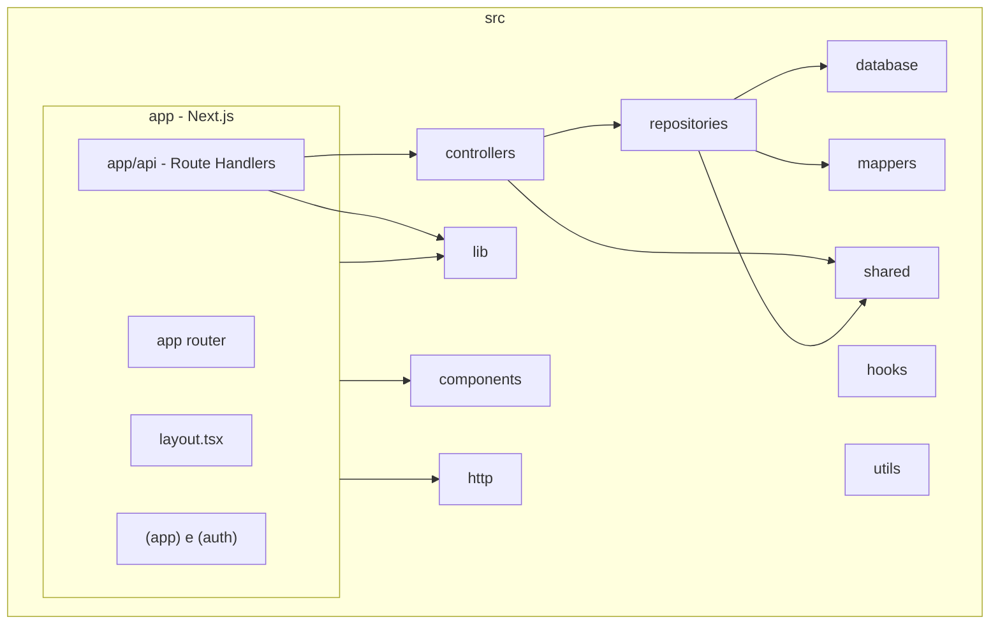
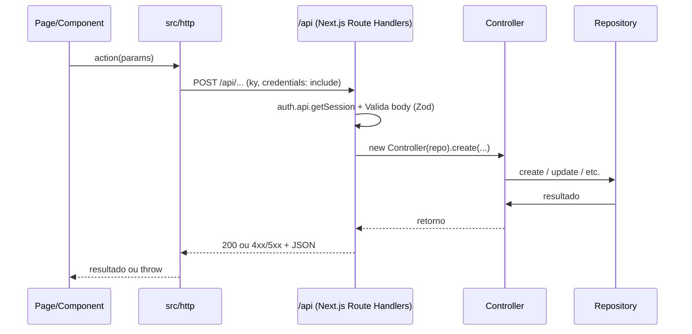
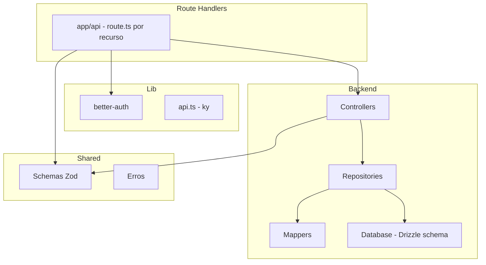
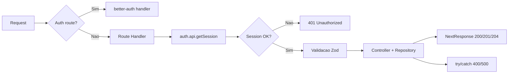

# Financial

Aplicação full-stack de gestão financeira: Next.js no frontend e API REST com Next.js Route Handlers no mesmo repositório. Inclui controle de despesas, categorias e investimentos, com autenticação (email/senha e GitHub) e backend em camadas (controllers, repositories, database).

---

## Estrutura do projeto

O código-fonte fica em `src/`. A aplicação divide-se em: **app** (Next.js, UI e Route Handlers em `app/api/`), **controllers**, **repositories**, **database**, **mappers**, e pastas compartilhadas (**http**, **lib**, **shared**, **hooks**, **utils**, **components**).



### Árvore de pastas (resumida)

```
src/
├── app/                    # Next.js App Router
│   ├── (app)/              # Rotas autenticadas (dashboard, transactions, categories, etc.)
│   ├── (auth)/             # Login e signup
│   ├── api/                # Next.js Route Handlers por recurso
│   │   ├── account/        # change-display-name
│   │   ├── auth/[...all]/  # better-auth handler
│   │   ├── buckets/
│   │   ├── categories/     # e categories/[id]
│   │   ├── me/
│   │   └── transactions/   # e transactions/[id]
│   ├── layout.tsx
│   └── globals.css
├── controllers/            # Controllers (recebem repositório; list, create, update, delete)
├── repositories/           # Implementações com Drizzle (bucket, category, transaction, user)
├── database/drizzle/       # Schema Drizzle, migrations, cliente db
├── mappers/                # Conversão persistência ↔ domínio
├── components/             # Componentes reutilizáveis e UI (shadcn)
│   ├── ui/                 # Primitivos de UI
│   └── ...                 # Layout e componentes compartilhados
├── http/                   # Funções que chamam a API (usam cliente em lib/api.ts)
├── lib/                    # api.ts (ky), auth client/server, React Query, better-auth, utils
├── shared/                 # Schemas Zod e erros (front + API)
├── hooks/
├── utils/
├── api-env.ts              # Variáveis de ambiente da API
└── env.ts                  # Variáveis de ambiente do frontend
```

- **`app/api/`**: cada recurso tem seu `route.ts` (GET, POST, PUT, DELETE). São Next.js Route Handlers que obtêm sessão, validam com Zod, instanciam Controller + Repository e devolvem `NextResponse.json`.
- **`app/`**: rotas, layouts e páginas do Next.js. Route groups `(app)` e `(auth)` não alteram a URL; o layout de `(app)` exige sessão e redireciona para login se não autenticado.
- **`controllers/`**: orquestram a lógica; recebem o repositório no construtor e expõem métodos como `list`, `create`, `update`, `delete`.
- **`repositories/`**: implementações com Drizzle; usam **mappers** para converter linhas do banco no formato de domínio.
- **`database/drizzle/`**: definição das tabelas, migrations e export do cliente `db` ([drizzle.config.ts](drizzle.config.ts) aponta para este path).
- **`components/`**: componentes globais (shell, sidebar, page) e `ui/` com os primitivos do shadcn.
- **`http/`**: funções que chamam a API (uma por ação), usando o cliente **ky** em [src/lib/api.ts](src/lib/api.ts) (`credentials: 'include'`).
- **`shared/schemas/`**: schemas Zod usados na validação da API e no frontend (tipos e contratos únicos).

---

## Geral

- **Projeto**: monólito full-stack (front + API) para controle financeiro (despesas, categorias, investimentos).
- **Runtime e pacotes**: [pnpm](https://pnpm.io) (lockfile `pnpm-lock.yaml`), módulos ESM (`"type": "module"`).
- **Linguagem**: TypeScript em modo strict, target ES2022; path alias `@/*` → `./src/*` ([tsconfig.json](tsconfig.json)).
- **Qualidade de código**:
  - **ESLint**: `eslint-config-next` (core-web-vitals + TypeScript), Prettier e `eslint-plugin-simple-import-sort` (ordem de imports como erro) — [eslint.config.mjs](eslint.config.mjs).
  - **Prettier**: printWidth 80, tabWidth 2, singleQuote, trailingComma all, arrowParens always, semi false.
- **Testes**: [Vitest](https://vitest.dev) (`pnpm run test` / `pnpm run test:watch`); testes em `*.test.ts`.
- **Banco e ambiente**: PostgreSQL 17 via [docker-compose.yml](docker-compose.yml); variáveis em [src/api-env.ts](src/api-env.ts) (API) e [src/env.ts](src/env.ts) (frontend).
- **Scripts**: `dev`, `build`, `start`, `lint`, `test`, `db:generate`, `db:migrate`, `db:push`, `db:studio`. O script `db:seed` está definido no `package.json` mas aponta para um arquivo que não existe; criar um seed em `src/database/` (ou outro path) e ajustar o script quando necessário.

### Como rodar

1. Instalar dependências: `pnpm install` (ou `npm install`).
2. Configurar `.env` com `DATABASE_URL`, `BETTER_AUTH_SECRET`, `BETTER_AUTH_URL`, `GITHUB_CLIENT_ID`, `GITHUB_CLIENT_SECRET`, `NEXT_PUBLIC_API_URL` (ver [src/api-env.ts](src/api-env.ts) e [src/env.ts](src/env.ts)).
3. Subir o Postgres: `docker compose up -d`.
4. Aplicar schema: `pnpm run db:push` ou `pnpm run db:migrate`.
5. Iniciar o app: `pnpm run dev` (ou `npm run dev`).

---

## Frontend

- **Framework**: [Next.js](https://nextjs.org) 16 com App Router e [React](https://react.dev) 19; [React Compiler](https://react.dev/learn/react-compiler) ativado em [next.config.ts](next.config.ts).
- **Rotas**: Route groups `(app)` (área autenticada) e `(auth)` (login/signup). O layout de `(app)` valida sessão no servidor e redireciona para login se não autenticado. As rotas da API estão listadas na seção Backend.
- **UI e estilo**:
  - [shadcn/ui](https://ui.shadcn.com) (estilo **new-york**, base **zinc**, CSS variables, RSC + TSX) — [components.json](components.json); ícones [Lucide](https://lucide.dev).
  - Componentes em `src/components/ui/` (Radix + Tailwind); layout e componentes compartilhados em `src/components/`.
  - [Tailwind CSS](https://tailwindcss.com) v4 em [src/app/globals.css](src/app/globals.css): `@import "tailwindcss"`, `tw-animate-css`, `tailwind-scrollbar`, tema com variáveis (radius, cores semânticas).
- **Formulários**: [React Hook Form](https://react-hook-form.com) + `@hookform/resolvers` (Zod) + componentes Form do shadcn; validação com Zod no cliente.
- **Dados e chamadas**: [TanStack React Query](https://tanstack.com/query/latest) em [src/lib/react-query-provider.tsx](src/lib/react-query-provider.tsx); o cliente HTTP é [ky](https://github.com/sindresorhus/ky) em [src/lib/api.ts](src/lib/api.ts) (`prefixUrl` + `credentials: 'include'`). As funções em `src/http/*` usam esse cliente para chamar a API em `NEXT_PUBLIC_API_URL`.
- **Autenticação**: [better-auth](https://www.better-auth.com) no cliente (`authClient.useSession()` etc.) em [src/lib/auth-client.ts](src/lib/auth-client.ts).
- **Padrões**:
  - **Composition (Compound Components)**: componentes compostos são exportados como um único objeto com subcomponentes nomeados (ex.: `Card.Root`, `Card.Content`, `Card.Header`). Cada subcomponente estende `ComponentProps` do elemento base; o uso no JSX fica declarativo e flexível. Ver `src/components/page.tsx` e componentes em `_components` das rotas.
  - Componentes de página/feature ficam em `_components` dentro da rota.
  - Client components com `'use client'` quando usam hooks ou interatividade; Server Components por padrão.
  - Feedback: [Sonner](https://sonner.emilkowal.ski) para toasts; Spinner em botões de submit.
- **Outros**: [Recharts](https://recharts.org) para gráficos; [Motion](https://motion.dev) para animações; [date-fns](https://date-fns.org); [react-day-picker](https://daypicker.dev) em calendários.

### Fluxo de uma ação no frontend



A página chama uma função de `src/http/*`, que usa o cliente ky em `lib/api.ts` para enviar requisições a `/api/*`. O Route Handler obtém a sessão, valida o body com Zod, instancia Controller e Repository, executa a ação e devolve status + JSON.

---

## Backend

- **API**: [Next.js Route Handlers](https://nextjs.org/docs/app/building-your-application/routing/route-handlers) em `src/app/api/`. Cada recurso tem seu próprio `route.ts` (GET, POST, PUT, DELETE). Base path: `/api`. Rotas atuais:
  - `account/general/change-display-name` — PUT
  - `auth/[...all]` — GET/POST (better-auth)
  - `buckets` — GET
  - `categories` — GET, POST; `categories/[id]` — PUT, DELETE
  - `me` — GET
  - `transactions` — GET, POST; `transactions/[id]` — PUT, DELETE
- **Autenticação**: better-auth em [src/lib/better-auth/auth.ts](src/lib/better-auth/auth.ts) com adapter Drizzle; email/senha e GitHub. O handler Next.js fica em [src/app/api/auth/[...all]/route.ts](src/app/api/auth/[...all]/route.ts) via `toNextJsHandler(auth)`. Rotas protegidas obtêm a sessão com `auth.api.getSession({ headers })` no início do handler e retornam 401 se não autenticado.
- **Fluxo típico**: Route Handler chama `auth.api.getSession` → valida body/params com Zod (`safeParse`) → instancia Repository e Controller → chama método do controller → em caso de sucesso retorna `NextResponse.json` (200/201/204); em caso de erro (try/catch) retorna 400/401/500 com JSON padronizado.
- **Validação**: Schemas Zod em [src/shared/schemas/](src/shared/schemas/) (category, transaction, bucket, change-display-name, errors).
- **Banco**: PostgreSQL; [Drizzle ORM](https://orm.drizzle.team) com schema em [src/database/drizzle/schema.ts](src/database/drizzle/schema.ts); migrations em `src/database/drizzle/migrations/`; [drizzle.config.ts](drizzle.config.ts) com dialect `postgresql` e `casing: 'snake_case'`. Tabelas de auth (Better Auth) e do domínio financeiro, multi-tenant por `userId`.

### Camadas do backend



- **Route Handlers**: recebem a requisição, validam sessão com better-auth, validam body/params com Zod, instanciam Controller e Repository e convertem o retorno em `NextResponse`.
- **Controllers**: orquestram a lógica; recebem o repositório no construtor e expõem métodos como `list`, `create`, `update`, `delete`.
- **Repositories**: implementações com Drizzle; usam **mappers** para converter linhas do banco no formato esperado pelo domínio.
- **Shared**: schemas Zod e erros de aplicação (UseCaseError, ResourceNotFoundError, etc.); as rotas atuais usam try/catch e respostas genéricas, mas os erros em `src/shared/errors/` e o tipo Either em `src/lib/safe-return/either.ts` existem para uso futuro.

### Fluxo de uma requisição protegida



As rotas `/api/auth/*` são tratadas pelo better-auth via `toNextJsHandler(auth)`. As demais são Route Handlers que chamam `auth.api.getSession` no início; se não houver sessão, retornam 401. Em seguida validam body/params com Zod, instanciam Controller e Repository, executam a ação e retornam o status e JSON apropriados.

### Estrutura das pastas de backend

```
src/
├── app/api/                    # Next.js Route Handlers (um route.ts por recurso)
│   ├── account/general/change-display-name/
│   ├── auth/[...all]/
│   ├── buckets/
│   ├── categories/              # e [id]
│   ├── me/
│   └── transactions/           # e [id]
├── controllers/                 # TransactionController, CategoryController, etc.
├── repositories/               # TransactionRepository, CategoryRepository, etc.
├── database/drizzle/
│   ├── index.ts                # Cliente db
│   ├── schema.ts               # Definição das tabelas
│   └── migrations/
├── mappers/                     # TransactionMapper, CategoryMapper, BucketMapper
├── shared/
│   ├── schemas/                # Zod (category, transaction, bucket, change-display-name, errors)
│   └── errors/                 # UseCaseError, ResourceNotFoundError, NotAllowedError, ConflictError
└── lib/
    ├── better-auth/auth.ts     # Config better-auth + adapter Drizzle
    ├── api.ts                  # Cliente ky para o frontend
    └── safe-return/either.ts   # Either (Left/Right) — disponível para uso futuro
```

Cada Route Handler em `app/api/` obtém a sessão com `auth.api.getSession`, valida o input com Zod, instancia o repositório e o controller, chama o método correspondente e retorna `NextResponse.json` com o status adequado.

**Nota**: As dependências Hono, `@hono/zod-openapi` e `@scalar/hono-api-reference` permanecem no `package.json` mas não são usadas na API atual (Next.js Route Handlers). Podem ser removidas ou reaproveitadas para documentação OpenAPI no futuro.
